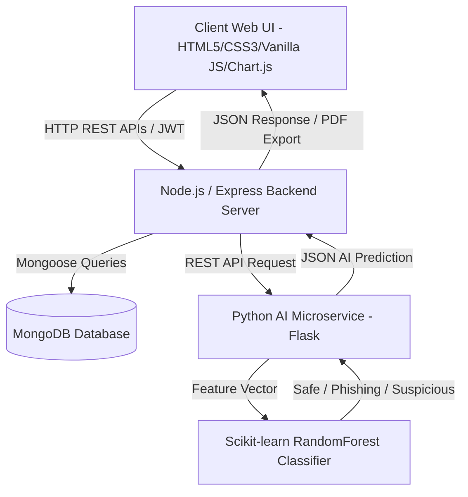

# CyberShield – AI-Based Web Security Monitoring System

**CyberShield** is an industry-level, full-stack AI-based web security monitoring system designed for real-time web threat identification, machine learning URL phishing detection, website security auditing, password strength entropy calculations, IP reputation evaluation, and PDF report generation.

---

## 🏛️ Architecture Overview



---

## 💻 Technology Stack

* **Frontend**: HTML5, Vanilla CSS3 (Glassmorphic + Cyberpunk Neon Dark Theme), Vanilla JavaScript, FontAwesome 6, Chart.js, jsPDF.
* **Backend**: Node.js, Express.js (MVC Architecture).
* **Database**: MongoDB & Mongoose.
* **Authentication**: JWT (JSON Web Tokens), bcryptjs password hashing, role-based authorization (`user` & `admin`).
* **Security & AI Engine**: Python 3, Flask, Scikit-learn (RandomForest Classifier), Joblib, NumPy, Pandas.
* **Middlewares & Hardening**: Helmet.js, Express Rate Limiter, CORS, Input Validator (express-validator), Sanitize Middleware.
* **API Documentation**: Swagger/OpenAPI 3.0
* **Testing**: Jest, Supertest
* **Code Quality**: ESLint, Prettier
* **CI/CD**: GitHub Actions

---

## 📁 Project Folder Structure

```
CyberShield/
├── client/
│   ├── index.html       # Landing page with feature highlights & hero
│   ├── login.html       # Cyberpunk glassmorphic login card
│   ├── register.html    # Registration page
│   ├── dashboard.html   # Admin & user security monitoring dashboard
│   ├── scanner.html     # Multi-tab security scanners
│   ├── password.html    # Password strength entropy & generator
│   ├── reports.html     # Security PDF & CSV audit report generator
│   ├── profile.html     # Account profile settings & 2FA toggle
│   └── admin.html       # Admin control panel, audit logs & tip manager
├── css/
│   └── style.css        # Glassmorphic dark cyberpunk design system
├── js/
│   ├── app.js           # Global API handler, toast notifications & state
│   ├── auth.js          # Authentication controller
│   ├── dashboard.js     # Dashboard data loader
│   ├── charts.js        # Chart.js pie, bar & line graph renderers
│   ├── scanner.js       # AI URL Phishing, Website SSL & IP handlers
│   ├── password.js      # Password entropy calculation & generator
│   ├── reports.js       # PDF report generator (jsPDF) & CSV export
│   ├── profile.js       # Profile management
│   └── admin.js         # User management table & global log viewer
├── server/
│   └── server.js        # Express application entry point
├── config/
│   ├── db.js            # MongoDB Mongoose database connection
│   └── swagger.js       # OpenAPI/Swagger documentation
├── models/
│   ├── User.js          # Mongoose User Schema
│   ├── Scan.js          # Mongoose Scan Schema
│   ├── Report.js        # Mongoose Audit Report Schema
│   ├── Log.js           # Mongoose System Audit Log Schema
│   ├── SecurityTip.js   # Mongoose Security Tip Schema
│   └── Notification.js  # System Notification Schema
├── controllers/
│   ├── authController.js
│   ├── scanController.js
│   ├── reportController.js
│   ├── userController.js
│   ├── adminController.js
│   └── tipController.js
├── routes/
│   ├── auth.js
│   ├── scan.js
│   ├── report.js
│   ├── user.js
│   ├── admin.js
│   ├── tip.js
│   ├── events.js        # SSE live activity feed
│   └── monitor.js       # Domain monitoring management
├── middleware/
│   ├── authMiddleware.js
│   ├── adminMiddleware.js
│   ├── errorHandler.js
│   └── validation.js    # Input validation with express-validator
├── utils/
│   ├── aiClient.js        # AI microservice client & local heuristic fallback
│   ├── passwordAnalyzer.js# Mathematical password entropy calculator
│   ├── securityScanner.js # Website SSL & HTTP header auditor
│   ├── ipChecker.js       # IP reputation & threat intelligence evaluator
│   └── domainInfo.js      # Domain structural analysis
├── scripts/
│   └── seedAdmin.js       # Admin user seeding script
├── __tests__/             # Jest test suite
├── python-ai/
│   ├── app.py           # Flask REST API microservice
│   ├── train_model.py   # Scikit-learn Random Forest model trainer (real datasets)
│   └── requirements.txt # Python dependencies
├── .github/workflows/    # CI/CD pipeline
├── package.json
└── README.md
```

---

## ⚡ Quick Start & Installation

### Prerequisites
- Node.js 18+
- Python 3.11+
- MongoDB (local or Atlas)
- Git

### 1. Backend Server Setup
```bash
cd CyberShield
npm install
cp .env.example .env
# Edit .env with your credentials
npm run seed:admin  # Create admin user
npm run dev
# Server running at http://localhost:5000
# API Docs at http://localhost:5000/api/docs
```

### 2. Python AI Microservice Setup
```bash
cd CyberShield/python-ai
pip install -r requirements.txt
python train_model.py  # Trains on real PhishTank + Tranco datasets
python app.py
# AI Microservice running at http://localhost:5001
```

### 3. Run Tests
```bash
cd CyberShield
npm test
npm run lint
npm run format
```

---

## 🔑 Default Credentials

| Role | Email | Password |
| :--- | :--- | :--- |
| **Administrator** | `admin@cybershield.io` | `Admin@123456` |
| **User** | (Register via UI) | (Set during registration) |

> ⚠️ **Security Note**: Change default admin credentials immediately after first login. Admin user is created via `npm run seed:admin` using environment variables.

---

## 🛡️ Key System Modules & Features

1. **AI URL Phishing Classifier**: Extracts 9 lexical URL features (IP address usage, HTTPS status, domain length, subdomain depth, hyphen/dot counts, suspicious keywords) and runs Scikit-learn RandomForest machine learning prediction. Trained on real PhishTank + OpenPhish datasets.
2. **Password Entropy & Time-to-Crack Estimator**: Calculates information entropy bits ($E = L \times \log_2(R)$), checks dictionary word lists, estimates brute-force cracking duration, and generates cryptographically secure 16-character passwords using `crypto.randomBytes()`.
3. **Website Security Auditor**: Inspects TLS/SSL encryption, HSTS enforcement, X-Frame-Options clickjacking vulnerability, Content Security Policy (CSP), Referrer-Policy, Permissions-Policy, and server banner disclosures. SSRF-protected with private IP/hostname blocklists.
4. **IP Reputation Lookup**: Evaluates ASN host types, VPN/Proxy anonymizers, country geolocation, and blacklist confidence scores.
5. **File Hash Analysis**: Checks MD5/SHA1/SHA256 against known malicious signatures (EICAR test files).
6. **PDF & CSV Audit Report Generator**: Produces branded PDF reports for offline archiving and exports threat logs to CSV.
7. **Admin Control Panel**: Features user management, global system audit logs, and security advisory tip publisher.
8. **Real-time SSE Live Feed**: Server-Sent Events for real-time scan activity updates on dashboard.
9. **Domain Monitoring**: Schedule automated security scans for tracked domains.
10. **Comprehensive Input Validation**: All API endpoints validated with express-validator.
11. **Security Hardening**: Helmet.js CSP, rate limiting (per-endpoint), JWT with env-only secrets, bcrypt 10-round hashing.

---

## 🔌 API Endpoints

| Route | Endpoints | Auth |
|-------|-----------|------|
| `/api/auth` | `POST /register`, `POST /login`, `POST /logout`, `GET /me` | ❌/✅ |
| `/api/scan` | `POST /url`, `POST /password`, `POST /website`, `POST /ip`, `POST /hash`, `GET /history`, `GET /stats` | ✅ |
| `/api/reports` | `GET /`, `POST /generate`, `GET /export-csv` | ✅ |
| `/api/user` | `GET /profile`, `PUT /profile`, `DELETE /profile` | ✅ |
| `/api/admin` | `GET /users`, `DELETE /users/:id`, `GET /logs`, `GET /stats` | ✅ Admin |
| `/api/tips` | `GET /`, `POST /` | ✅/Admin |
| `/api/events` | `GET /feed` (SSE) | ✅ |
| `/api/monitor` | `GET /`, `POST /`, `DELETE /:target` | ✅ |
| `/api/health` | `GET /` | ❌ |

📚 **Interactive API Documentation**: Available at `/api/docs` (Swagger UI)

---

## 🧪 Testing

```bash
# Run all tests with coverage
npm test

# Run linting
npm run lint

# Format code with Prettier
npm run format
```

---

## 🚀 Deployment

### Render (Recommended)
1. Connect GitHub repository to Render
2. Create two Web Services:
   - **Backend**: Node.js, build `npm install`, start `npm start`
   - **AI Service**: Python, build `pip install -r requirements.txt && python train_model.py`, start `python app.py`
3. Set environment variables in Render dashboard:
   - `MONGO_URI`, `JWT_SECRET`, `PYTHON_AI_URL`, `NODE_ENV=production`
   - For AI service: `PORT=5001`

### Docker
```bash
docker-compose up -d
```

---

## 🔒 Security Best Practices Implemented

- ✅ JWT secrets only from environment variables (fail in production if missing)
- ✅ bcrypt password hashing (10 rounds)
- ✅ Rate limiting: 100 req/15min (prod), 5 login attempts/15min
- ✅ Helmet.js with CSP (production), CORS configuration
- ✅ SSRF protection: Private IP/hostname blocklists + DNS resolution checks
- ✅ Input validation on all endpoints (express-validator)
- ✅ Request size limits (10KB JSON/URL-encoded)
- ✅ Database indexes for query performance
- ✅ Error handling without stack traces in production
- ✅ Cryptographically secure password generation (`crypto.randomBytes`)
- ✅ Admin role assigned only via seeding script, not email pattern

---

## 🎓 CSE Final Year Project Compliance

This project satisfies all requirements for a final-year Computer Science Engineering capstone project, demonstrating:
- Full-Stack Web Architecture (MVC, REST APIs, Microservices)
- Machine Learning Model Training & Integration (Real datasets, Scikit-learn)
- Security Hardening (OWASP best practices)
- Responsive UI/UX Design (Glassmorphic dark theme)
- DevOps Practices (CI/CD, Testing, Linting, Documentation)
- Database Design (Indexes, Relationships, Auditing)
