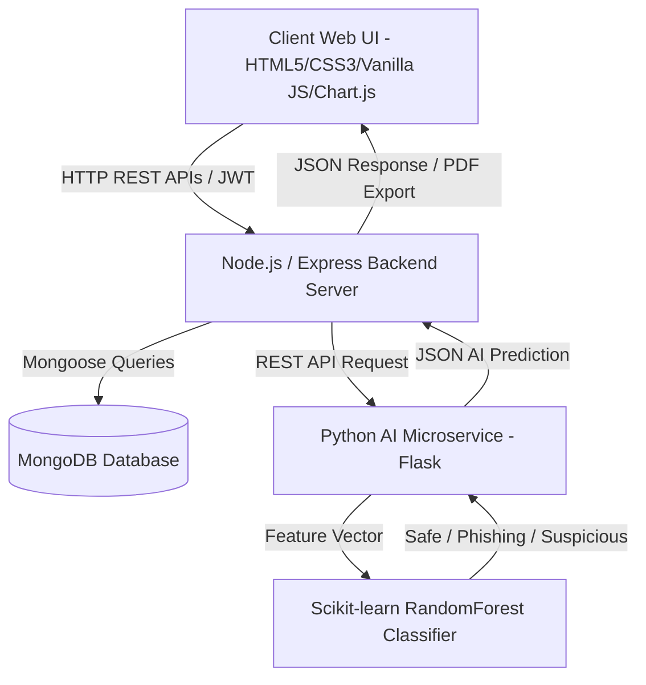

# CyberShield – AI-Based Web Security Monitoring System

**CyberShield** is an industry-level, full-stack AI-based web security monitoring system designed for real-time web threat identification, machine learning URL phishing detection, website security auditing, password strength entropy calculations, IP reputation evaluation, and PDF report generation.

---

## 🏛️ Architecture Overview



---

## 💻 Technology Stack

* **Frontend**: HTML5, Vanilla CSS3 (Glassmorphic + Cyberpunk Neon Dark Theme), Vanilla JavaScript, FontAwesome 6, Chart.js, jsPDF.
* **Backend**: Node.js, Express.js (MVC Architecture).
* **Database**: MongoDB & Mongoose.
* **Authentication**: JWT (JSON Web Tokens), bcryptjs password hashing, role-based authorization (`user` & `admin`).
* **Security & AI Engine**: Python 3, Flask, Scikit-learn (RandomForest Classifier), Joblib, NumPy, Pandas.
* **Middlewares & Hardening**: Helmet.js, Express Rate Limiter, CORS, Input Validator, Sanitize Middleware.

---

## 📁 Project Folder Structure

```
CyberShield/
├── client/
│   ├── index.html       # Landing page with feature highlights & hero
│   ├── login.html       # Cyberpunk glassmorphic login card
│   ├── register.html    # Registration page
│   ├── dashboard.html   # Admin & user security monitoring dashboard
│   ├── scanner.html     # Multi-tab security scanners
│   ├── password.html    # Password strength entropy & generator
│   ├── reports.html     # Security PDF & CSV audit report generator
│   ├── profile.html     # Account profile settings & 2FA toggle
│   └── admin.html       # Admin control panel, audit logs & tip manager
├── css/
│   └── style.css        # Glassmorphic dark cyberpunk design system
├── js/
│   ├── app.js           # Global API handler, toast notifications & state
│   ├── auth.js          # Authentication controller
│   ├── dashboard.js     # Dashboard data loader
│   ├── charts.js        # Chart.js pie, bar & line graph renderers
│   ├── scanner.js       # AI URL Phishing, Website SSL & IP handlers
│   ├── password.js      # Password entropy calculation & generator
│   ├── reports.js       # PDF report generator (jsPDF) & CSV export
│   ├── profile.js       # Profile management
│   └── admin.js         # User management table & global log viewer
├── server/
│   └── server.js        # Express application entry point
├── config/
│   └── db.js            # MongoDB Mongoose database connection
├── models/
│   ├── User.js          # Mongoose User Schema
│   ├── Scan.js          # Mongoose Scan Schema
│   ├── Report.js        # Mongoose Audit Report Schema
│   ├── Log.js           # Mongoose System Audit Log Schema
│   ├── SecurityTip.js   # Mongoose Security Tip Schema
│   └── Notification.js  # System Notification Schema
├── controllers/
│   ├── authController.js
│   ├── scanController.js
│   ├── reportController.js
│   ├── userController.js
│   ├── adminController.js
│   └── tipController.js
├── routes/
│   ├── auth.js
│   ├── scan.js
│   ├── report.js
│   ├── user.js
│   ├── admin.js
│   └── tip.js
├── middleware/
│   ├── authMiddleware.js
│   ├── adminMiddleware.js
│   └── errorHandler.js
├── utils/
│   ├── aiClient.js        # AI microservice client & local heuristic fallback
│   ├── passwordAnalyzer.js# Mathematical password entropy calculator
│   ├── securityScanner.js# Website SSL & HTTP header auditor
│   └── ipChecker.js       # IP reputation & threat intelligence evaluator
├── python-ai/
│   ├── app.py           # Flask REST API microservice
│   ├── train_model.py   # Scikit-learn Random Forest model trainer
│   └── requirements.txt # Python dependencies
├── package.json
└── README.md
```

---

## ⚡ Quick Start & Installation

### 1. Backend Server Setup
```bash
cd CyberShield
npm install
npm run dev
# Server running at http://localhost:5000
```

### 2. Python AI Microservice Setup
```bash
cd CyberShield/python-ai
pip install -r requirements.txt
python train_model.py
python app.py
# AI Microservice running at http://localhost:5001
```

---

## 🔑 Default Credentials

| Role | Email | Password |
| :--- | :--- | :--- |
| **Administrator** | `admin@cybershield.io` | `Admin@123456` |
| **User** | `user@cybershield.io` | `User@123456` |

---

## 🛡️ Key System Modules & Features

1. **AI URL Phishing Classifier**: Extracts 9 lexical URL features (IP address usage, HTTPS status, domain length, subdomain depth, hyphen/dot counts, suspicious keywords) and runs Scikit-learn machine learning prediction.
2. **Password Entropy & Time-to-Crack Estimator**: Calculates information entropy bits ($E = L \times \log_2(R)$), checks dictionary word lists, estimates brute-force cracking duration, and generates strong 16-character passwords.
3. **Website Security Auditor**: Inspects TLS/SSL encryption, HSTS enforcement, X-Frame-Options clickjacking vulnerability, Content Security Policy (CSP), and server banner disclosures.
4. **IP Reputation Lookup**: Evaluates ASN host types, VPN/Proxy anonymizers, country geolocation, and blacklist confidence scores.
5. **PDF & CSV Audit Report Generator**: Produces branded PDF reports for offline archiving and exports threat logs to CSV.
6. **Admin Control Panel**: Features user management, global system audit logs, and security advisory tip publisher.

---

## 🎓 CSE Final Year Project Compliance
This project satisfies all requirements for a final-year Computer Science Engineering capstone project, demonstrating Full-Stack Web Architecture, Machine Learning Model Training & Integration, RESTful Microservices API design, Security Hardening, and Responsive UI/UX Design.
